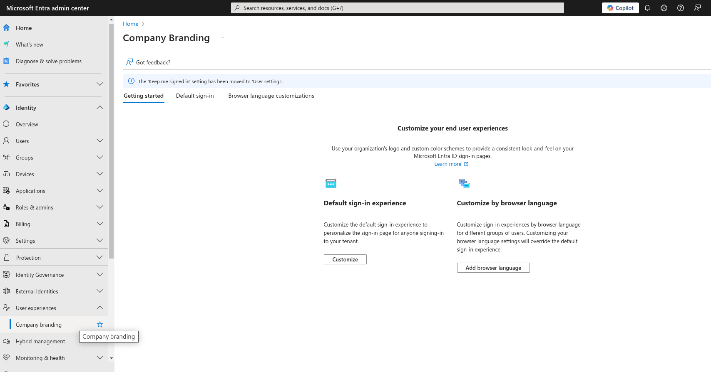
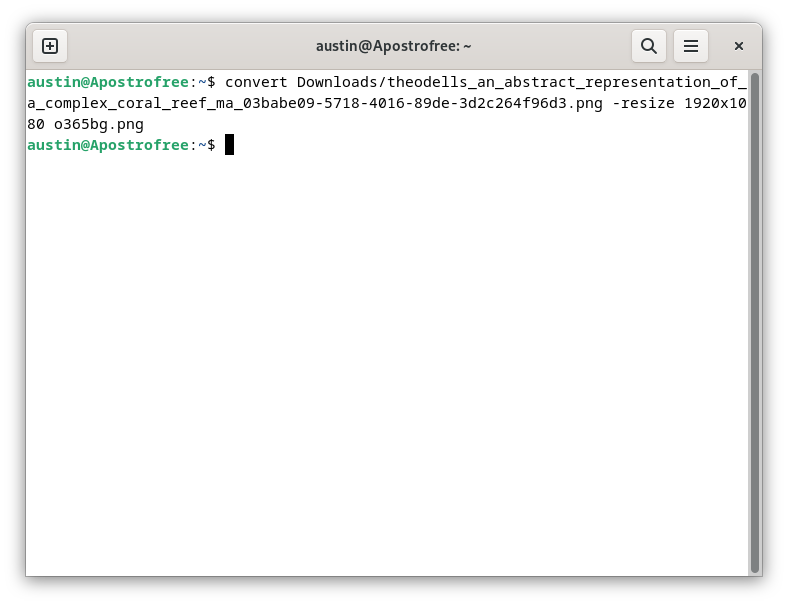
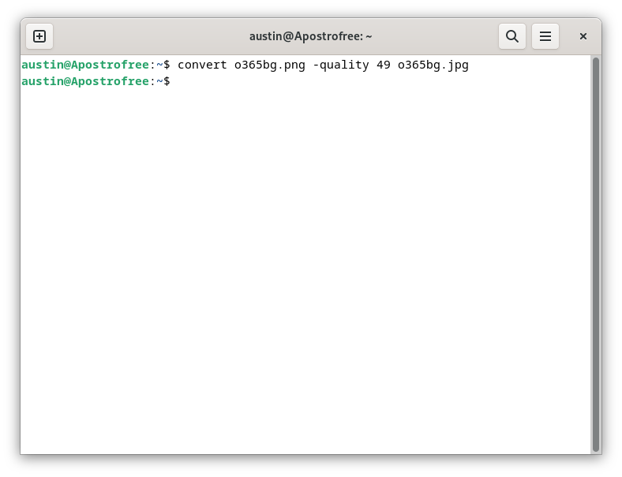
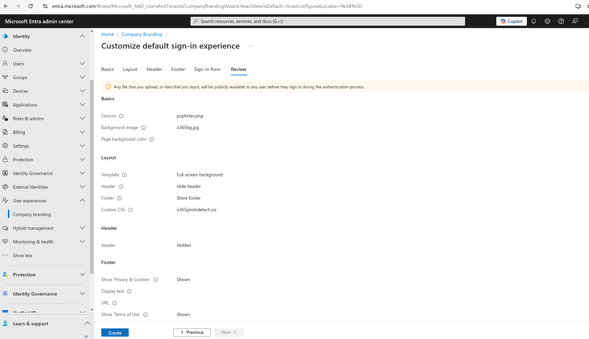
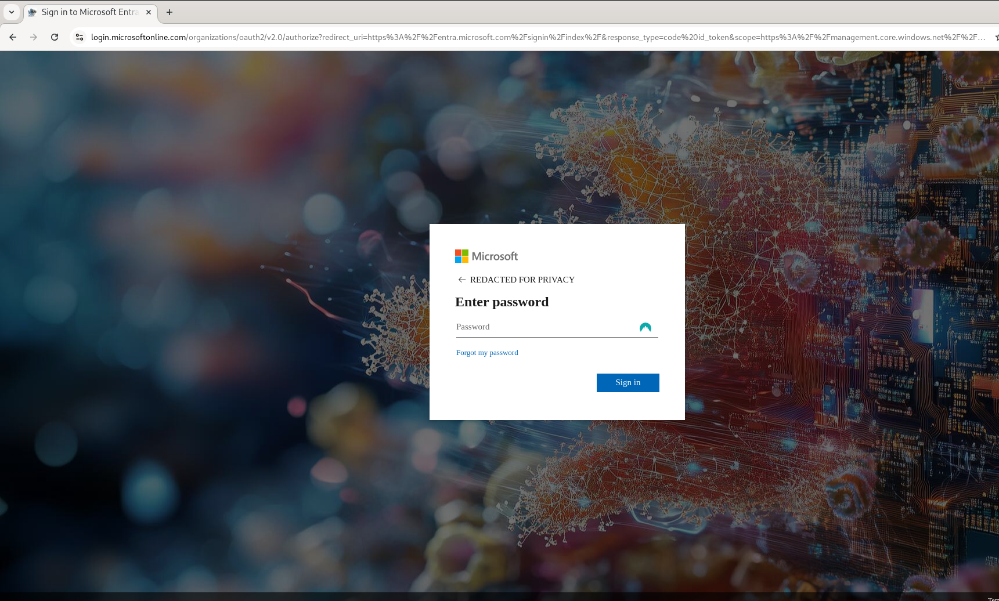
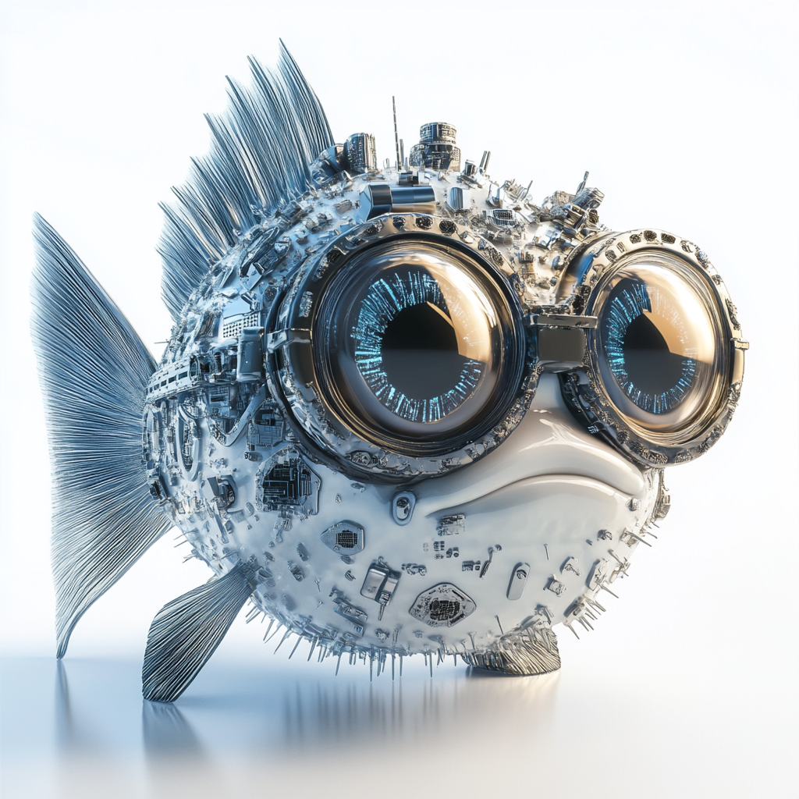

I Made this M365/EntraID Login Portal Look Super Cool but\....

I also incorporated anti-phishing protection measures. Find out how!

Customizing your Microsoft365/EntraID login portal allows your business
to personalize and enhance your employees login experience, but did you
know that it can also help protect your employees against a rapidly
growing threat? PhaaS(Phishing as a Service) attacks are becoming
increasingly prevalent and advanced. The barrier to entry for even the
least sophisticated attackers to access VERY convincing phishing capable
of stealing MFA tokens alongside passwords is now as low as having a
couple of dollars worth of crypto and a Telegram account. I've
previously written about Darcula Suite 3.0 and FlowerStorm which are
both readily available and can perform (AiTM) attacks to steal tokens
and circumvent MFA. By customizing your O365 login portal you provide
some protection against these attacks as your users will \*hopefully\*
notice if their login page does not match the brand's customized
appearance they're used to. We will also incorporate a hidden element
that will alert us by email when it loads on a URL other than the
official Microsoft login page!

To customize your Microsoft365/O365/EntraID login portal first log into
the EntraID Admin portal and navigate to "Company Branding" under
Identity\>User Experience\>Company Branding (Or simply type it in the
search
bar){width="6.5in"
height="3.40625in"}{width="6.5in"
height="3.40625in"}{width="6.5in"
height="4.989583333333333in"}{width="6.5in"
height="4.989583333333333in"}Make sure that the selected images are the
correct size and pixel dimensions using your preferred method and upload
them for the favicon and background.

{width="6.5in"
height="3.5833333333333335in"}For additional protection we will use
didsomeoneclone.me to create a honeytoken that we can use the custom CSS
feature located on the next step: layout. Simply generate a link for
login.microsoftonline.com and enter your email.

{width="6.5in"
height="3.75in"}Retrieve the link from your email, and create the
following CSS file(making sure to use YOUR link):

{width="6.5in"
height="4.989583333333333in"}Now upload the CSS file you created to
Custom CSS under Layout.

{width="6.5in"
height="3.75in"}Optionally you can customize the banner, logo, and more
if you so desire. Next click on Review and Create and finally smash that
Create button.

{width="6.5in"
height="3.75in"}There you go! An easily recognizable, and distinct login
experience that your employees will certainly notice if/when it suddenly
looks generic, with the added benefit of an invisible AitM(adversary in
the middle)/Evilginx/Reverse proxy alert feature that will immediately
notify you via email if/when an employee clicks on many advanced
phishing links.

{width="6.5in"
height="3.9166666666666665in"}And here's our little anti-phishing
champion, and extremely hard to see favicon himself as a lovely little
bonus! 😉

{width="4.333333333333333in"
height="4.333333333333333in"}
